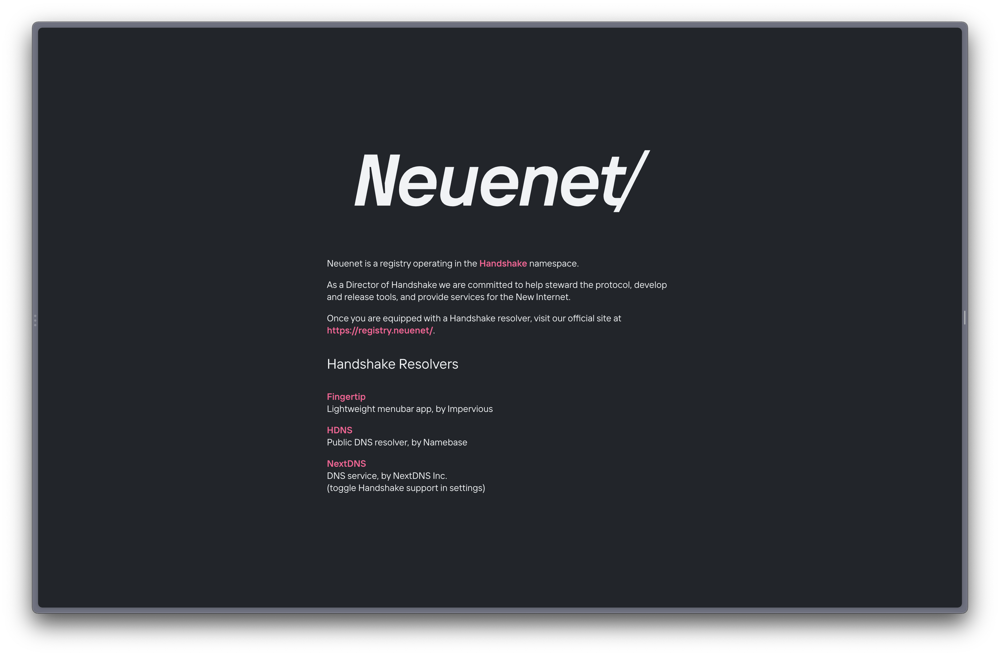

# registry




## Installation

```sh
npm i
# if running for the first time, also run following command
npx install husky
```

## Development

```sh
npm run watch
```

## Debugging

For UI debugging, add the `debug` class to `<u-grid/>`.

```sh
# Run all tests
npm test

# Make sure dependencies are up-to-date
npm run test:dependencies

# Test Svelte components
npm run test:svelte

# Test TypeScript files
npm run test:typescript
```

## Production

```sh
npm start
```
